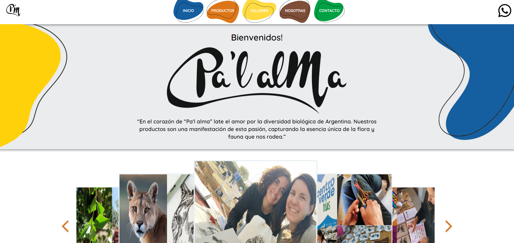
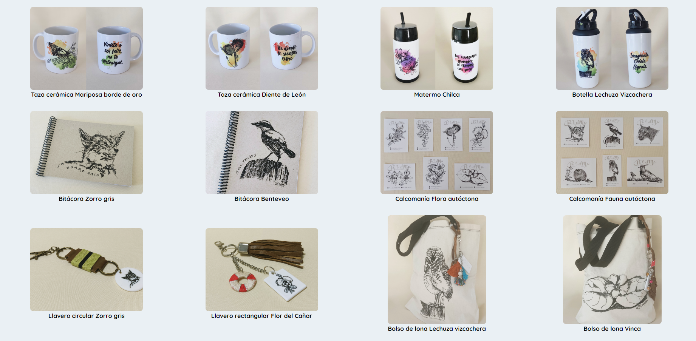
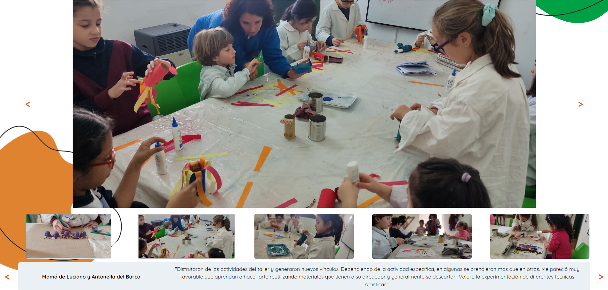
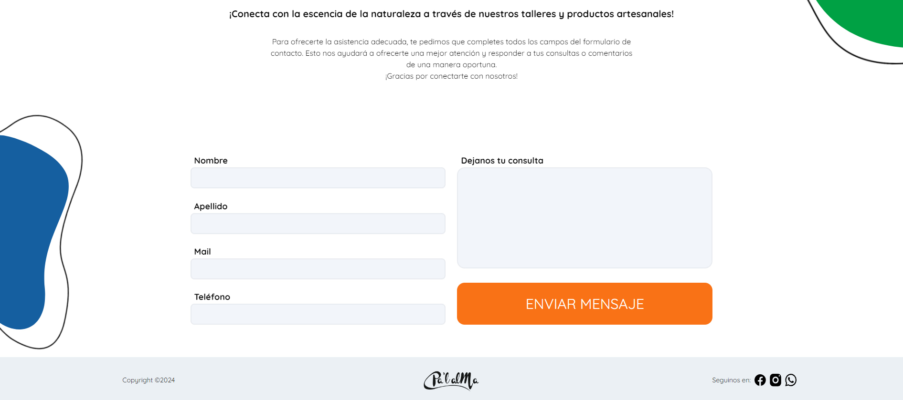

# Pa'l Alma Website

> Welcome to the repository of the Pa'l Alma Website! This project is the result of two months of effort and collaboration between a talented team of people, with the aim of enhancing the online presence of Pa'l Alma, an organization based in Córdoba, Argentina.

> You can find the website [_here_](https://pal-alma.vercel.app/).

## Table of Contents

- [General Info](#general-info)
- [Technologies](#technologies)
- [Screenshots](#screenshots)
- [Project Status](#project-status)
- [Acknowledgements](#acknowledgements)

## General Info

This repository houses the code and resources used in the development of the main website for Pa'l Alma, an Argentine organization dedicated to sharing their passion for art and nature through their crafts and workshops. This project was conceived as a prize awarded for reaching the top 10 at Coderhouse, providing participants with the opportunity to apply their skills to a real and meaningful project. The website itself is fully responsive and can be viewed on any device.

## Technologies

Project is created with:

- [Next.js](https://nextjs.org/) - 14.0.3
- [Tailwind CSS](https://tailwindcss.com/) - 3.3.0
- [Axios](https://axios-http.com/) - 1.6.2
- [React Slick](https://react-slick.neostack.com/) - 0.29.0
- [Getform.io](https://getform.io/)

## Screenshots

---

---

---

## Project Status

Project is: _Finished_

## Acknowledgements

- A special thanks to the entire team for their dedication and collaborative spirit throughout the development of the Pa'l Alma website:
  - **UX/UI Designers:**
    - [Marina Ayelén Piam](https://www.linkedin.com/in/marinaayelenpiam/)
    - [Sandy Ocampo](https://www.linkedin.com/in/sandyocampo/)
  - **Frontend Developers:**
    - [Franco Ursino](https://www.linkedin.com/in/francoursino/)
    - [Maicol Marcenaro](https://www.linkedin.com/in/maicol-marcenaro/)
    - [Ricardo Lemos](https://www.linkedin.com/in/ricardolemos22/)
    - [Tomás Echeveste Arteaga](https://www.linkedin.com/in/tomasecheveste/)
- Many thanks to María and Patricia, the owners of Pa'l Alma, for their support throughout the development of this project.
- Many thanks to Coderhouse for the opportunity to work on this project.
